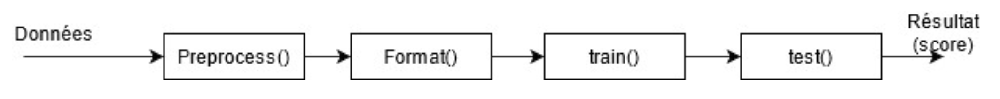
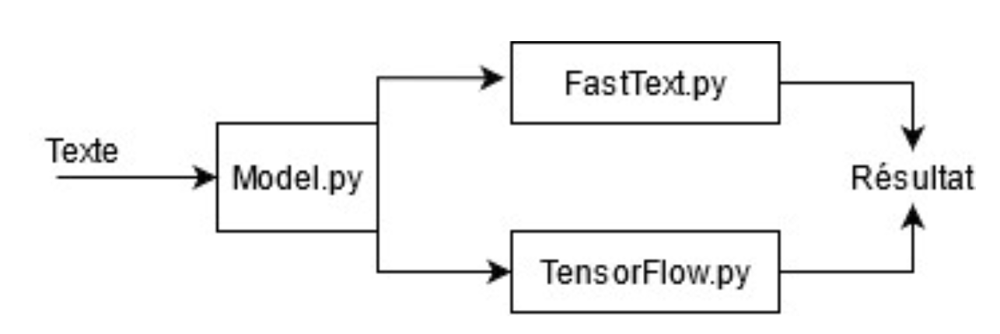
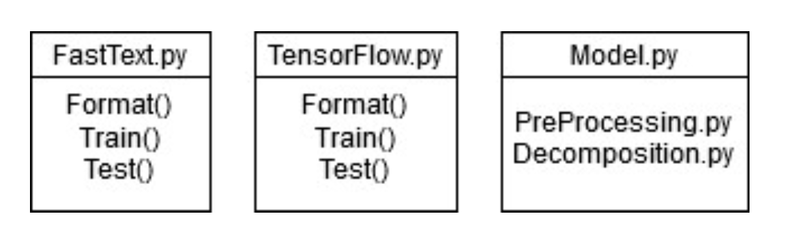

# fake_news_detection

This project was made for the final school project at l'ÉTS University (écode de technologie supérieure) in spring 2021.

The fully detailed report can be found [here](./report/Rapport-Technique-Finale-PFE2021.pdf) (in French).

## Project summary

The goal of the project was to train a model capable of detecting fake news. The data that would be used to do that was found on Kaggle ([link](https://www.kaggle.com/datasets/clmentbisaillon/fake-and-real-news-dataset)).

After reviewing many papers and looking for what was already done with similar datasets, we decided to try two different model architecutes: 
1. Linear architecture with FastText.
2. Neural architecture with a feed-forward neural network implemented using Tensorflow.

We kept the architectures simple because of the size of the data and the short on average articles in the data.

## Architecture

The project follows this architecture:

To make the comparison easier, all preprocessing is done initially in the same manner and then formatted for the respective models.

Both models share the same interface through the `Model` object and can be manipulated in the same ways. 

After the data is processed, the respective models have their local functions that they use to format, train and test:

## Results

| Model               | Params                                                                 | Precision |
| ------------------- | ---------------------------------------------------------------------- | --------- |
| FastText Classifier | Epochs: 100, learning rate: 0.0075                                     | 93.67%    |
| TensorFlow FNN      | Epochs: 40, hidden layers : 32, hidden units: 625, embedding size: 125 | 99.28%    | 

Since the dataset is balanced, we use precision as a metric.

The TensorFlow FNN model performed better on the test set, but when tested on an out of dataset sample of data, it performed poorly compared to FastText. 
That means two things:
1. The data isn't diverse enough for the models to learn to classify everyday news.
2. FastText generalized better when challenged with types of articles it has never seen.

